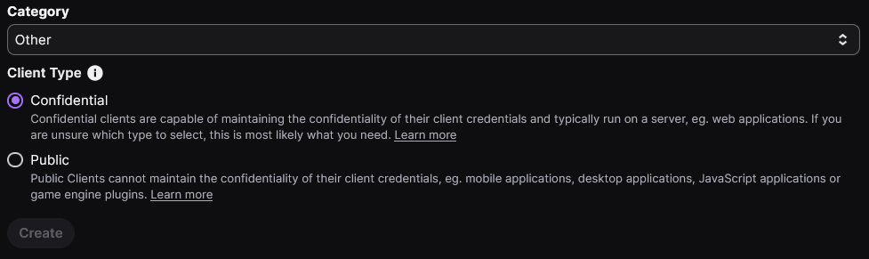

head to https://dev.twitch.tv/console  
to get your API credentials.  

  

  

  

As OAuth Redirect URLs, you can put `http://localhost`.  

Make changes to the `resources.ini` to fit your needs, add the client ID and client secret (required for fetching clips).  

OBS source will be a 'browser source' - as URL put `http://localhost:8000/` or whatever port is in the `resources.ini`.  

`launch.py` will install and launch. After initially running `launch.py`, you should be able to just run `clips_server.py`. You can add a Python script to launch automatically with OBS; otherwise, you'll need to run it manually.  

