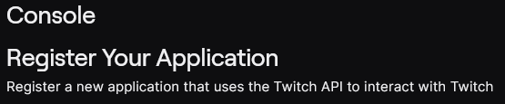

# OBS Clips Player

## TL;DR
1. Get API credentials.
2. Fill out `resources.ini`.
3. Run `launch.py`.

---

### Step 1: Get API Credentials
Head to [Twitch Developer Console](https://dev.twitch.tv/console) to register your application and obtain API credentials.

  
  
  

As the OAuth Redirect URL, you can use `http://localhost`.

---

### Step 2: Configure `resources.ini`
Make changes to the `resources.ini` file to fit your needs. Add the `client_id` and `client_secret` (required for fetching clips). Ensure the directory paths follow the format `C:/Users/...`.

---

### Step 3: Set Up OBS Browser Source
In OBS, add a 'Browser Source'. Use the URL `http://localhost:8000/` or the port specified in `resources.ini`.

---

### Step 4: Run the Application
Run `launch.py` to install dependencies and launch the application. After the initial setup, you can run `clips_server.py` directly. You can also configure OBS to launch the Python script automatically, or run it manually.

---

### Troubleshooting
#### Clips Not Downloading
If clips fail to download, ensure `twitch-dl` is working properly:
1. Navigate to your working directory using `cd C:/Users/...` (replace with the actual path).
2. Activate the virtual environment by running:
   ```
   .venv\Scripts\activate
   ```
3. Locate `twitch-dl` using:
   ```
   where twitch-dl
   ```
   This will print the path to the executable. Only the directory matters.

4. Set a PATH variable using:
   ```
   setx PATH "directory_of_twitch-dl"
   ```
   Replace `directory_of_twitch-dl` with the actual directory containing the `twitch-dl.exe` file.

---

### Notes
- Ensure all paths in `resources.ini` use the correct format (`C:/Users/...`).
- Verify that OBS is configured correctly with the browser source URL.